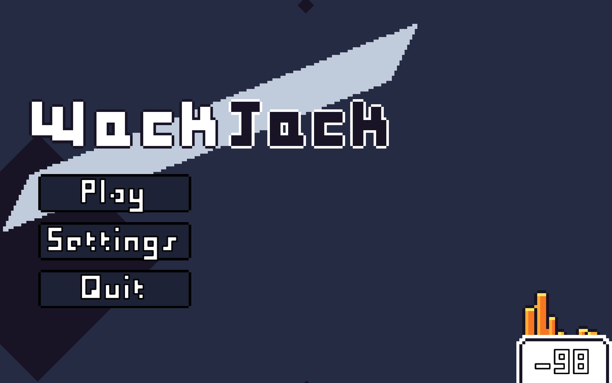
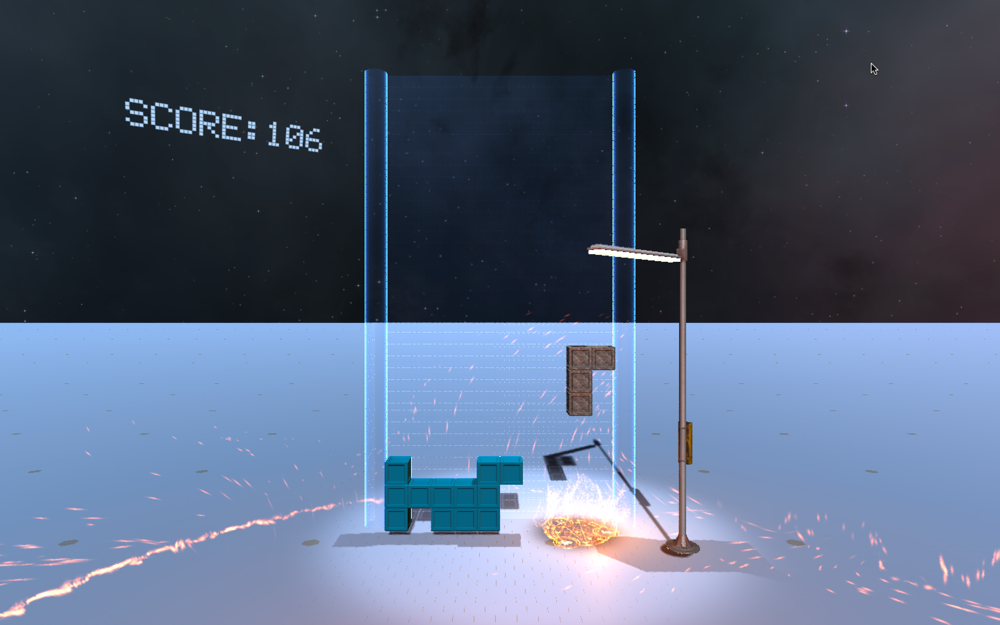
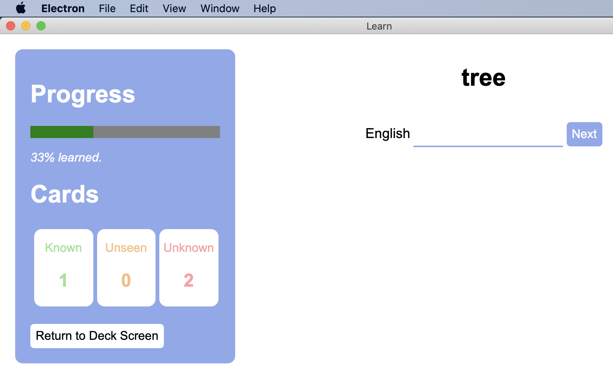
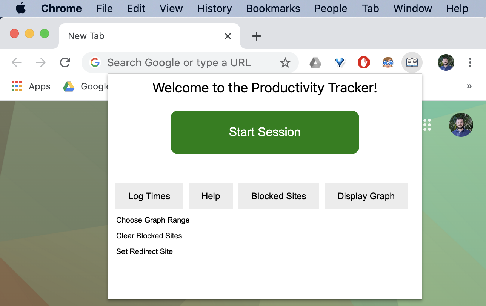

<!DOCTYPE html>
<html lang="en">
    <head>
        <meta charset="utf-8" />
        <meta name="viewport" content="width=device-width, initial-scale=1, shrink-to-fit=no" />
        <meta name="description" content="" />
        <meta name="author" content="" />
        <title>Soft Dev Student Portfolio</title>
        <!-- Font Awesome icons (free version)-->
        
        <!-- Google fonts-->
        <link href="https://fonts.googleapis.com/css?family=Montserrat:400,700" rel="stylesheet" type="text/css" />
        <link href="https://fonts.googleapis.com/css?family=Lato:400,700,400italic,700italic" rel="stylesheet" type="text/css" />
        <!-- Core theme CSS (includes Bootstrap)-->
        <link href="css/styles.css" rel="stylesheet" />
    </head>
    
    <body id="page-top">
        
        <!-- Navigation-->
        <nav class="navbar navbar-expand-lg bg-secondary text-uppercase fixed-top" id="mainNav">
            

                <a class="navbar-brand js-scroll-trigger" href="#page-top">Software Development</a><button class="navbar-toggler navbar-toggler-right text-uppercase font-weight-bold bg-primary text-white rounded" type="button" data-toggle="collapse" data-target="#navbarResponsive" aria-controls="navbarResponsive" aria-expanded="false" aria-label="Toggle navigation">Menu <i class="fas fa-bars"></i></button>
                

                    <ul class="navbar-nav ml-auto">
                        <li class="nav-item mx-0 mx-lg-1"><a class="nav-link py-3 px-0 px-lg-3 rounded js-scroll-trigger" href="#portfolio">Portfolio</a></li>
                        <li class="nav-item mx-0 mx-lg-1"><a class="nav-link py-3 px-0 px-lg-3 rounded js-scroll-trigger" href="#about">About</a></li>
                        <li class="nav-item mx-0 mx-lg-1"><a class="nav-link py-3 px-0 px-lg-3 rounded js-scroll-trigger" href="#contact">Contact</a></li>
                    </ul>
                

            

        </nav>
        
        <!-- Masthead-->
        <header class="masthead bg-primary text-white text-center">
            

                <!-- Masthead Avatar Image-->
                
                <!-- Masthead Heading-->
                <h1 class="masthead-heading text-uppercase mb-0">Software Development</h1>
                <!-- Icon Divider-->
                

                    

                    
<i class="fas fa-star"></i>

                    

                

                <!-- Masthead Subheading-->
                <h6 class="masthead-subheading font-weight-light mb-2">The Bishop's School</h6>
                <h6 class="masthead-subheading font-weight-light mb-0">Spring 2020</h6>
            

        </header>
        
        <!-- Portfolio Section-->
        <section class="page-section portfolio" id="portfolio">
            

                <!-- Portfolio Section Heading-->
                <h2 class="page-section-heading text-center text-uppercase text-secondary mb-0">Portfolio</h2>
                <!-- Icon Divider-->
                

                    

                    
<i class="fas fa-star"></i>

                    

                

                <!-- Portfolio Grid Items-->
                

                    <!-- Portfolio Item 1-->
                    

                        

                            

                                
<i class="fas fa-plus fa-3x"></i>

                            

                            
                        

                    

                    <!-- Portfolio Item 2-->
                    

                        

                            

                                
<i class="fas fa-plus fa-3x"></i>

                            

                            
                        

                    

                    <!-- Portfolio Item 3-->
                    

                        

                            

                                
<i class="fas fa-plus fa-3x"></i>

                            

                            
                        

                    

                    <!-- Portfolio Item 4-->
                    

                        

                            

                                
<i class="fas fa-plus fa-3x"></i>

                            

                            
                        

                    

                    <!-- Portfolio Item 5-->
                    

                        

                            

                                
<i class="fas fa-plus fa-3x"></i>

                            

                            
                        

                    

                    <!-- Portfolio Item 6-->
                    

                        

                            

                                
<i class="fas fa-plus fa-3x"></i>

                            

                            
                        

                    

                

            

        </section>
        
        <!-- About Section-->
        <section class="page-section bg-primary text-white mb-0" id="about">
            

                <!-- About Section Heading-->
                <h2 class="page-section-heading text-center text-uppercase text-white">About</h2>
                <!-- Icon Divider-->
                

                    

                    
<i class="fas fa-star"></i>

                    

                

                <!-- About Section Content-->
                

                    

                        This year long course provides students with a solid foundation in software development using a modern programming language such as Python. Important concepts covered include algorithms, control structures, loops, blocks, scopes, methods, attributes, classes and objects. It continues with programming core topics and features including implementing arrays, searching, sorting, enumerated types, inheritance and exception handling.

                    

Students use appropriate development tools, environment and design methods to support the software development process. Much of this course is project-based. Daily assignments focus on writing and developing efficient algorithms with good class design. This course covers the same concepts and skills as that of the AP Computer Science curriculum using the Python language in place of the Java programming language. 

                

                <!-- About Section Button-->
                

                    <a class="btn btn-xl btn-outline-light" target="_blank" href="https://bishops.myschoolapp.com/ftpimages/613/download/download_3960751.pdf" >
                        <i class="fas fa-download mr-2"></i>Curriculum Guide
                    </a>
                

            

        </section>
        
        <!-- Contact Section-->
        <section class="page-section" id="contact">
            

                <!-- Contact Section Heading-->
                <h2 class="page-section-heading text-center text-uppercase text-secondary mb-0">Contact Me</h2>
                <!-- Icon Divider-->
                

                    

                    
<i class="fas fa-star"></i>

                    

                

                <!-- Contact Section Form-->
                

                    

                        <!-- To configure the contact form email address, go to mail/contact_me.php and update the email address in the PHP file on line 19.-->
                        <form id="contactForm" name="sentMessage" novalidate="novalidate">
                            

                                

                                    <label>Name</label><input class="form-control" id="name" type="text" placeholder="Name" required="required" data-validation-required-message="Please enter your name." />
                                    

                                

                            

                            

                                

                                    <label>Email Address</label><input class="form-control" id="email" type="email" placeholder="Email Address" required="required" data-validation-required-message="Please enter your email address." />
                                    

                                

                            

                            

                                

                                    <label>Phone Number</label><input class="form-control" id="phone" type="tel" placeholder="Phone Number" required="required" data-validation-required-message="Please enter your phone number." />
                                    

                                

                            

                            

                                

                                    <label>Message</label><textarea class="form-control" id="message" rows="5" placeholder="Message" required="required" data-validation-required-message="Please enter a message."></textarea>
                                    

                                

                            

                             
                            

                            
<button class="btn btn-primary btn-xl" id="sendMessageButton" type="submit">Send</button>

                        </form>
                    

                

            

        </section>
        
        <!-- Footer-->
        <footer class="footer text-center">
            

                

                    <!-- Footer Location-->
                    

                        <h4 class="text-uppercase mb-4">Location</h4>
                        
7607 La Jolla Blvd San Diego, CA 92037

                    

                    <!-- Footer Social Icons-->
                    

                        <h4 class="text-uppercase mb-4">Around the Web</h4>
                        <a class="btn btn-outline-light btn-social mx-1" target="_blank" href="https://www.facebook.com/the.bishops.school"><i class="fab fa-fw fa-facebook-f"></i></a>
                        <a class="btn btn-outline-light btn-social mx-1" target="_blank" href="https://www.instagram.com/the_bishops_school/"><i class="fab fa-fw fa-instagram"></i></a>
                        <a class="btn btn-outline-light btn-social mx-1" target="_blank" href="http://www.youtube.com/BishopsSchool"><i class="fab fa-fw fa-youtube"></i></a>
                        <a class="btn btn-outline-light btn-social mx-1" target="_blank" href="https://www.bishops.com/"><i class="fas fa-fw fa-globe"></i></a>
                    

                    <!-- Footer About Text-->
                    

                        <h4 class="text-uppercase mb-4">About Bishop's</h4>
                        
The Bishop’s School is an independent, coeducational college-preparatory day school for students in grades six through twelve who live throughout San Diego County.

                    

                

            

        </footer>
        
        <!-- Copyright Section-->
        <section class="copyright py-4 text-center text-white">
            
<small>Copyright © Joshua Bloom 2020</small>

        </section>
        
        <!-- Scroll to Top Button (Only visible on small and extra-small screen sizes)-->
        

            <a class="js-scroll-trigger d-block text-center text-white rounded" href="#page-top"><i class="fa fa-chevron-up"></i></a>
        

        
        <!-- Portfolio Modals-->
        
        <!-- Portfolio Modal 1-->
        

            

                

                    <button class="close" type="button" data-dismiss="modal" aria-label="Close">
                        <i class="fas fa-times"></i>
                    </button>
                    

                        

                            

                                

                                    <!-- Portfolio Modal - Title-->
                                    <h2 class="portfolio-modal-title text-secondary text-uppercase mb-0">Wack Jack</h2>
                                    <!-- Icon Divider-->
                                    

                                        

                                        
<i class="fas fa-star"></i>

                                        

                                    

                                    <!-- Portfolio Modal - Image-->
                                    
                                    <!-- Portfolio Modal - Text-->
                                    
Aiden Khazeni and Matthew Erdman developed WackJack, a video game for deployment on Mac and PC computers.  Their game is largely based on Blackjack, the card game, but with a few twists and an enhanced UI.  To create a more immersive experience for the user, Aiden and Matthew decided to build the app with Unity, a cross-platform, three-dimensional game engine.  This meant that they had to learn a new programming language and development environment before building the app, but they somehow managed to pull it off (with style!).  You can download the game here:

                                    <a class="btn btn-xl btn-primary" href="https://drive.google.com/file/d/1UdZwI9TcCWc5b7hNQlWDkTNMly7VPAod/view?usp=sharing" target="_blank"><i class="fas fa-download mr-2"></i>macOS</a>
                                    <a class="btn btn-xl btn-primary" href="https://drive.google.com/file/d/1_4RJScevfTYQLjuy5SDoy1N-OduONtJ1/view?usp=sharing" target="_blank"><i class="fas fa-download mr-2"></i>Windows</a>
                                

                            

                        

                    

                

            

        

        
        <!-- Portfolio Modal 2-->
        

            

                

                    <button class="close" type="button" data-dismiss="modal" aria-label="Close">
                        <i class="fas fa-times"></i>
                    </button>
                    

                        

                            

                                

                                    <!-- Portfolio Modal - Title-->
                                    <h2 class="portfolio-modal-title text-secondary text-uppercase mb-0">T3DRIS</h2>
                                    <!-- Icon Divider-->
                                    

                                        

                                        
<i class="fas fa-star"></i>

                                        

                                    

                                    <!-- Portfolio Modal - Image--><!-- Portfolio Modal - Text-->
                                    
Daniel Xu and Hausen Wu developed T3DRIS, a video game for deployment on Mac and PC computers.  Their game is largely based on Tetris but with a few twists and an enhanced UI.  To create a more immersive experience for the user, Daniel and Hausen decided to build the app with Unity, a cross-platform, three-dimensional game engine.  This meant that they had to learn a new programming language and development environment before building the app, but they somehow managed to pull it off (and with style!).  You can download the game here:

                                    <a class="btn btn-xl btn-primary" href="https://drive.google.com/file/d/1VxLN-u0LWmhVJao-mr5EVc1-F8Wkp_5u/view?usp=sharing" target="_blank"><i class="fas fa-download mr-2"></i>macOS</a>
                                    <a class="btn btn-xl btn-primary" href="https://drive.google.com/file/d/18LmlKZg5aKjApb_qTHItBYfIQ0FxIKrR/view?usp=sharing" target="_blank"><i class="fas fa-download mr-2"></i>Windows</a>
                                

                            

                        

                    

                

            

        

        <!-- Portfolio Modal 3-->
        

            

                

                    <button class="close" type="button" data-dismiss="modal" aria-label="Close">
                        <i class="fas fa-times"></i>
                    </button>
                    

                        

                            

                                

                                    <!-- Portfolio Modal - Title-->
                                    <h2 class="portfolio-modal-title text-secondary text-uppercase mb-0">Flashcards</h2>
                                    <!-- Icon Divider-->
                                    

                                        

                                        
<i class="fas fa-star"></i>

                                        

                                    

                                    <!-- Portfolio Modal - Image--><!-- Portfolio Modal - Text-->
                                    
Eli developed Flashcards, a desktop application for deployment on Mac and PC computers.  The app allows users to create and study digital flashcards, as you might expect, but what makes Eli’s app unique is that the flashcards can have more than two sides!   Users can study multiple foreign languages at once, or vocabulary spellings and pronunciations, or anything else users can come up with--the possibilities are endless!  To create a more immersive experience for the user, Eli decided to build the app with Electron, an open-source software framework for designing cross-platform desktop applications using web technologies.  This meant that he had to learn three new programming languages before building the app, but he managed to pull it off and somehow did so with style!

                                    <a class="btn btn-xl btn-primary" href="#" target="_blank"><i class="fas fa-download mr-2"></i>macOS</a>
                                    <a class="btn btn-xl btn-primary" href="#" target="_blank"><i class="fas fa-download mr-2"></i>Windows</a>
                                

                            

                        

                    

                

            

        

        <!-- Portfolio Modal 4-->
        

            

                

                    <button class="close" type="button" data-dismiss="modal" aria-label="Close">
                        <i class="fas fa-times"></i>
                    </button>
                    

                        

                            

                                

                                    <!-- Portfolio Modal - Title-->
                                    <h2 class="portfolio-modal-title text-secondary text-uppercase mb-0">Lit Recipes</h2>
                                    <!-- Icon Divider-->
                                    

                                        

                                        
<i class="fas fa-star"></i>

                                        

                                    

                                    <!-- Portfolio Modal - Image--><!-- Portfolio Modal - Text-->
                                    
Annie’s app is called, LitRecipes.  You tell it what ingredients you have in your fridge--and your dietary restrictions--and it tells you what you can make with those ingredients.  Annie uses the Edamam API (https://developer.edamam.com/) to search for recipes that meet your criteria and Python’s standard GUI package, Tkinter, to display the results, complete with thumbnail photos, prep/cook time, and calorie count.

                                    <a class="btn btn-xl btn-primary" href="#" target="_blank"><i class="fas fa-download mr-2"></i>macOS</a>
                                    <a class="btn btn-xl btn-primary" href="#" target="_blank"><i class="fas fa-download mr-2"></i>Windows</a>
                                

                            

                        

                    

                

            

        

        <!-- Portfolio Modal 5-->
        

            

                

                    <button class="close" type="button" data-dismiss="modal" aria-label="Close">
                        <i class="fas fa-times"></i>
                    </button>
                    

                        

                            

                                

                                    <!-- Portfolio Modal - Title-->
                                    <h2 class="portfolio-modal-title text-secondary text-uppercase mb-0">Productivity Tracker</h2>
                                    <!-- Icon Divider-->
                                    

                                        

                                        
<i class="fas fa-star"></i>

                                        

                                    

                                    <!-- Portfolio Modal - Image--><!-- Portfolio Modal - Text-->
                                    
Eddie’s app is a Google Chrome Extension called, Productivity Tracker.  You toggle the extension when you start working and it prevents you from accessing any and all websites on your “blocked” list.  When you’re finished working, toggle the extension one more time and you’re free to surf the web again.  You can also record time spent being working in the log and view a graph of your productivity data.

                                    <a class="btn btn-xl btn-primary" href="#" target="_blank"><i class="fas fa-download mr-2"></i>macOS</a>
                                    <a class="btn btn-xl btn-primary" href="#" target="_blank"><i class="fas fa-download mr-2"></i>Windows</a>
                                

                            

                        

                    

                

            

        

        <!-- Portfolio Modal 6-->
        

            

                

                    <button class="close" type="button" data-dismiss="modal" aria-label="Close">
                        <i class="fas fa-times"></i>
                    </button>
                    

                        

                            

                                

                                    <!-- Portfolio Modal - Title-->
                                    <h2 class="portfolio-modal-title text-secondary text-uppercase mb-0">Submarine</h2>
                                    <!-- Icon Divider-->
                                    

                                        

                                        
<i class="fas fa-star"></i>

                                        

                                    

                                    <!-- Portfolio Modal - Image--><!-- Portfolio Modal - Text-->
                                    
Lorem ipsum dolor sit amet, consectetur adipisicing elit. Mollitia neque assumenda ipsam nihil, molestias magnam, recusandae quos quis inventore quisquam velit asperiores, vitae? Reprehenderit soluta, eos quod consequuntur itaque. Nam.

                                    <button class="btn btn-primary" href="#" data-dismiss="modal"><i class="fas fa-times fa-fw"></i>Close Window</button>
                                

                            

                        

                    

                

            

        

        <!-- Bootstrap core JS-->
        
        
        <!-- Third party plugin JS-->
        
        <!-- Contact form JS-->
        
        
        <!-- Core theme JS-->
        
    </body>
</html>
